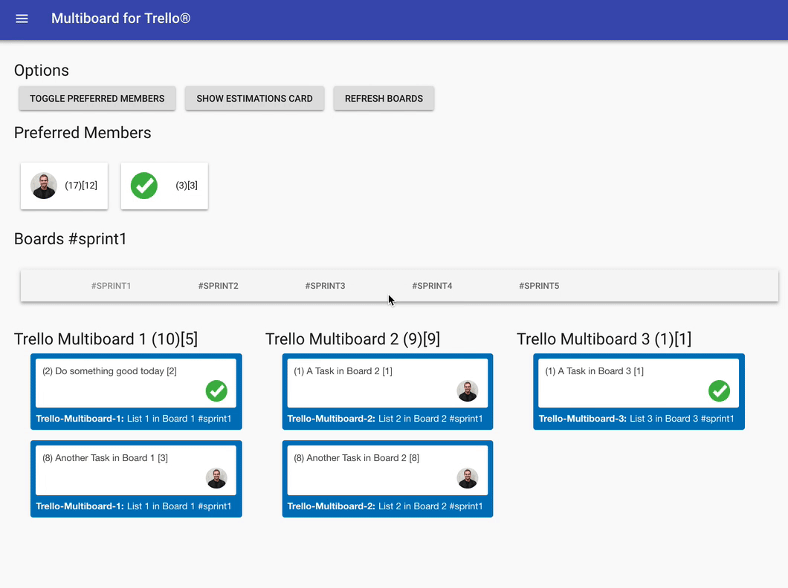

# React-Trello-Multiboard

[](https://travis-ci.org/natterstefan/react-trello-multiboard)
[](https://github.com/natterstefan/react-trello-multiboard/blob/master/package.json)
[](https://github.com/natterstefan/react-trello-multiboard/blob/master/package.json)
[](https://coveralls.io/github/natterstefan/react-trello-multiboard?branch=master)
[](https://snyk.io/test/github/natterstefan/react-trello-multiboard)
[](https://github.com/natterstefan/react-trello-multiboard/blob/master/LICENCE)



React-Trello-Multiboard is a single-page application built with React displaying
multiple cards of several Trello® boards and lists. The cards can be filtered by
preferred team members.

<!-- TOC -->

## Table of Contents

* [React-Trello-Multiboard](#react-trello-multiboard)
  * [Main Features](#main-features)
  * [Example](#example)
  * [Development & Build Requirements](#development--build-requirements)
  * [Setup & Configuration Quickstart](#setup--configuration-quickstart)
    * [Trello API Key](#trello-api-key)
    * [Dependencies](#dependencies)
    * [Config.js](#configjs)
    * [Google Analytics & Privacy Page](#google-analytics--privacy-page)
  * [URL Shortcuts & Bookmarks](#url-shortcuts--bookmarks)
  * [How to start the App locally](#how-to-start-the-app-locally)
  * [How to build the App for Production](#how-to-build-the-app-for-production)
  * [How to develop and contribute](#how-to-develop-and-contribute)
    * [List of npm scripts and git hooks](#list-of-npm-scripts-and-git-hooks)
  * [How to test your changes](#how-to-test-your-changes)
  * [Troubleshooting](#troubleshooting)
  * [Licence](#licence)
  * [More Examples](#more-examples)
  * [Maintainers](#maintainers)
  * [Changelog](CHANGES.md)

<!-- /TOC -->

## Main features

* :memo: flexible multiboard configuration (eg. select multiple lists to display from multiple boards)
* :office: optimised teamwork experience, (eg. send deeplinks to your colleagues with their stories already filtered)
* :door: add private (accessible only to invited members of the Board) and public Trello boards
* :lock: your data stays secure in your browser and is not shared with others
* :hammer: built with awesome technologies, like: [react 16.x](https://github.com/facebook/react),
  [react-router-dom](https://github.com/ReactTraining/react-router/tree/master/packages/react-router-dom),
  [redux](https://github.com/reduxjs/redux), [material-ui](https://github.com/mui-org/material-ui)
  and [styled-components](https://github.com/styled-components/styled-components) (to name a few)
* :package: Small package size thanks to [webpack](https://github.com/webpack) and
  [size-limit](https://github.com/ai/size-limit)
* :muscle: There's more to come. :grinning:

## Example


As you can see in the example, there are three Trello® boards and two members.
From each board all cards of a list matching the `#sprint1` pattern in the
title (can be any pattern, defined in [config.js](config/config.example.js)) is
listed below. Each member can be selected, which causes the list of cards to only
show those of the selected member. Additionally, you see five sprints on the page.
You can select one sprint and see the cards of the selected pattern. This allows
you to plan ahead.

You can find the example in the gif above here: [https://multiboardfortrello.com/example/#/](https://bit.ly/2KfeewR)

## Development & Build Requirements

[](https://github.com/natterstefan/react-trello-multiboard/stargazers)
[](https://github.com/natterstefan/react-trello-multiboard/network)
[](https://github.com/natterstefan/react-trello-multiboard/issues)
[](https://twitter.com/intent/tweet?text=https://github.com/natterstefan/react-trello-multiboard)

```
  node v8.9.x
  npm 5.6.x

  // or
  yarn 1.3.x
```

Switch to the required version with `nvm use`. If you have not installed this
node version, install it with eg. `nvm install v8.9.4`.

#### Full Example Setup with nvm

```sh
  // first install nvm (eg. with brew)
  brew install nvm

  // then install the required node version
  nvm install v8.9.4

  // and the required npm version (if you have not npm 5.6.x)
  npm install -g npm@5.6.0

  // finally use the just installed versions
  nvm use
```

## Setup & Configuration Quickstart

### Trello API Key

Log in to Trello and get your api key here: [https://trello.com/app-key][1]

### Dependencies

First install all Dependencies with

```sh
  yarn // or npm install
```

### Config.js

Once you have installed all dependencies, yarn/npm will copy `./config/config.example.js`
for you and rename it to `./config/config.js`. You then have to customize it according to
your needs and eg. enter your [API key][1] and other settings into the `config.js`.

```js
module.exports = {
  app_title: 'Multiboard for Trello®',
  api_key: 'your_api_key',
  google_analytics_property: 'UA-12345678-9',
  company_member: 'exampleusername'
  preferred_members: /exampleusername|anotheruser/,
  lists: [/#sprint1/, /#sprint2/, /#sprint3/],
  boards: [
    {
      shortcut: 'hw',
      name: 'hello-world',
      id: 'board-1',
      estimates_with_round_brackets: true,
      estimates_with_square_brackets: true,
    },
  ],
}
```

The main config properties look like this:

* `app_title`: name that appears in the Menubar and website title
* `api_key`: your [trello api key][1]
* `google_analytics_property`: your Google Analytics property
* `company_member`: representing the company and available on all cards, because
  this user is used to calculate the company estimations when all members are
  toggled
* `preferred_members`: usernames of the ones you want to highlight, filter and
  calculate the estimations from. Note: currently the app can only display
  preferred members and not all of the found ones
* `lists` (array with regex strings): search pattern of the list name(s) you
  want to get tasks from
* `boards`: array of board configs

The list of boards should contain board objects like this:

* `shortcut` (string): the title above each list of tasks
* `name` (string): name of trello board
* `id` (string, optional): id of trello board, only required when board is public but user should see it
* `estimates_with_round_brackets` (bool)
* `estimates_with_square_brackets` (bool)

With the `id` property you can add boards, which are public and the user is not
part of when accessing your TrelloMultiBoard App.

##### How to get the id of your board?

Let's assume the url of your board looks like this: https://trello.com/b/123asdf/hello-world.
You can get the id of the board now by changing the url to: https://trello.com/b/123asdf/hello-world.json.
Wait for some time (depends on the number of lists and card of the board) and
you should see a result similar to

```
 { "id": "IGVA5wQ67w2mBbkctLxi", "name": "hello-world", "desc":"", ... }
```

The id at the beginning of the JSON is the id of the board.

#### Estimations Configuration

Additionally you can calculate and get the estimations from the cards, if their
name looks similar to: "Setup server \(3)\[1]". Now you can turn the feature on
by adding one of the following boolean flags to the board' config.

* `estimates_with_round_brackets` (bool)
* `estimates_with_square_brackets` (bool)

Each of the values will be summed up by their type.

Example:

* Board name: Example-Board
* Card 1: "Setup server \(3)\[1]"
* Card 2: "Upload docker imge \(3)\[0]"

Would result in the following total estimation for the board: Example-Board \(6)\[1]

### Google Analytics & Privacy Page

It is possible to integrate Google Analytics with pageviews by simply adding
`google_analytics_property` to the `config.js`. This will add
https://www.google-analytics.com/analytics.js to the app and track pageviews.
By default doNotTrack browser settings are respected.

At the same time a privacy page (eg. http://localhost:2222/#/privacy) is created
and a CookieNotice presented to new users. The content can be defined in
[src/pages-content](src/pages-content) by adding a [privacy.md](src/pages-content/privacy.example.md)
file.

By default [`gaOptout`](https://developers.google.com/analytics/devguides/collection/gajs/#disable)
is available to set a disable Google Analytics cookie in the user's browser.

One can use it like this in the `privacy.md` file:

```md
Or you deactivate it with a DoNotTrack Cookie: <a href="javascript:gaOptout();">Deactive Google Analytics</a>.
```

## URL Shortcuts & Bookmarks

Certain url links can be used to eg. customize the inital lists and selected member:

* Selected lists on page refresh
  * http://localhost:2222/#/?pattern=#sprint-1,#sprint-2,\<other-patterns>
  * http://localhost:2222/#/pattern/#sprint-1,#sprint-2,#sprint-3/
* Filter a member already
  * http://localhost:2222/#/member/\<preferred-member-username>

## How to start the App locally

Now, when you have set up the `config.js` start the app with: `yarn start`. The
webpack-dev-server will start the app and open: [http://localhost:2222/#/][2].

You can now interact with the board, filter members or show all cards again.

## How to build the App for Production

`yarn start` will build and run a development version of the app, but you should
create a stable and production ready build with `yarn build` before you upload
the files onto your server.

The output will be available in the `dist` folder.

## How to develop and contribute

Clone the repository, commit your changes and create a PR for new features,
bugfixes or other ideas.

### List of npm scripts and git hooks

The following scripts are available (also work with `npm run`):

* `yarn analyse`: bundles the production build and analyses it with [Jarvis][4],
  see other analyse [here][5].
* `yarn lint`: lints the js-code with Eslint (without `--fix`)
* `yarn lint:scss`: lints the scss-code with Stylelint (without `--fix`)
* `yarn start`: starts the app with the webpack-dev-server
* `yarn test`: runs tests with jest
* `yarn test:watch`: runs tests with jest in watch mode
* `yarn test:coverage`: runs tests with jest and creates a coverage report
* `yarn test:verbose`: runs tests with jest in the verbose mode

#### Pre-Commit Hooks

When attempting to commit and push changes, some taks will automatically run:

* **JavaScript files (.js):**

  * runs `eslint` and `prettier` and formats the code
  * runs all related tests of the committed files with `jest`

* **Scss files (.scss):**
  * runs `stylelint` and formats the code

#### Pre-Push Hooks

Runs all tests with Jest.

### How to Test your Changes

Jest was selected as the test framework for this app. Simply run it with one of
the test commands listed above. A cheatsheet for some of the most important features
can be found [here](https://devhints.io/jest).

## Troubleshooting

If you run into problems building the App or working with the source code, [create
an issue please][3].

## Licence

[Apache License 2.0](LICENCE)

We are not affiliated, associated, authorized, endorsed by or in any way
officially connected to Trello®, Inc. (www.trello.com).

## More Examples

I would be very happy if you tell me more about your project and if your TrelloMultiBoard
is public I can list it here if you want.

## Maintainers

<table>
  <tbody>
    <tr>
      <td align="center">
        <a href="https://github.com/natterstefan">
          
          </br>
          Stefan Natter
        </a>
        <div>
          <a href="https://twitter.com/natterstefan">
            
          </a>
        </div>
      </td>
    </tr>
  <tbody>
</table>

[1]: https://trello.com/app-key
[2]: http://localhost:2222/#/
[3]: https://github.com/natterstefan/react-trello-multiboard/issues
[4]: https://github.com/zouhir/jarvis
[5]: https://survivejs.com/webpack/optimizing/build-analysis/
