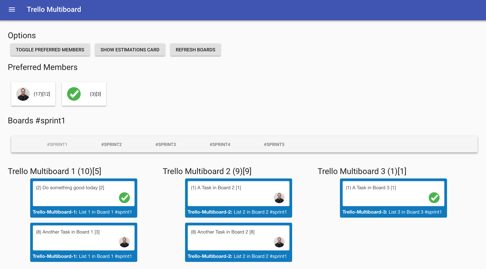

# React-Trello-Multiboard

[](https://travis-ci.org/natterstefan/react-trello-multiboard)
[](https://github.com/natterstefan/react-trello-multiboard/blob/master/package.json)
[](https://github.com/natterstefan/react-trello-multiboard/blob/master/package.json)
[](https://coveralls.io/github/natterstefan/react-trello-multiboard?branch=master)
[](https://snyk.io/test/github/natterstefan/react-trello-multiboard)
[](https://github.com/natterstefan/react-trello-multiboard/blob/master/LICENCE)

[](https://github.com/natterstefan/react-trello-multiboard/stargazers)
[](https://github.com/natterstefan/react-trello-multiboard/network)
[](https://github.com/natterstefan/react-trello-multiboard/issues)
[](https://twitter.com/intent/tweet?text=https://github.com/natterstefan/react-trello-multiboard)

React-Trello-Multiboard is a React application displaying multiple cards of
several Trello boards and lists. The cards can be filtered by preferred team
members.

## Main features

* flexible multiboard configuration (eg. select multiple lists to display from multiple boards)
* deeplinking: send links to preferred members with their stories already filtered
* built with awesome technologies, like: [react 16.x](https://github.com/facebook/react),
  [react-router-dom](https://github.com/ReactTraining/react-router/tree/master/packages/react-router-dom),
  [redux](https://github.com/reduxjs/redux), [material-ui](https://github.com/mui-org/material-ui)
  and [styled-components](https://github.com/styled-components/styled-components) (to name a few)
* :muscle: There's more to come. :grinning:

## Example



As you can see in the example, there are three boards in the list. From each board
the list with the matching pattern `#pattern` in the title (can be any pattern,
defined in [config.js](config/config.example.js)) is listed below. Each member
can be filtered for and only his cards are presented then.

## Requirements

```
  node v8.9.x
  npm 5.6.x

  // or
  yarn 1.3.x
```

Switch to the required version with `nvm use`. If you have not installed this
node version, install it with eg. `nvm install v8.9.4`.

### Trello API Key

Log in to trello and get your api key here: [https://trello.com/app-key][1]

### Full Example Setup with nvm

```sh
  // first install nvm (eg. with brew)
  brew install nvm

  // then install the required node version
  nvm install v8.9.4

  // and the required npm version (if you have not npm 5.6.x)
  npm install -g npm@5.6.0

  // finally use the just installed versions
  nvm use
```

## Setup & Configuration

```sh
  yarn // or npm install
```

Once you have installed all requirements, yarn/npm will copy `./config/config.example.js`
for you and rename it to `./config/config.js`. You then have to customize it according to
your needs and eg. enter your [API key][1] and other settings into the `config.js`.

```js
module.exports = {
  app_title: 'Trello Multiboard',
  api_key: 'your_api_key',
  company_member: 'exampleusername'
  preferred_members: /exampleusername|anotheruser/,
  boards: [
    {
      shortcut: 'hw',
      board: 'hello-world',
      lists: /#upcoming/,
      estimates_with_round_brackets: true,
      estimates_with_square_brackets: true,
    },
  ],
}
```

### Configuration Description

The main config properties look like this:

* `app_title`: name that appears in the Menubar and website title
* `api_key`: your [trello api key][1]
* `company_member`: representing the company and available on all cards, because
  this user is used to calculate the company estimations when all members are
  toggled
* `preferred_members`: usernames of the ones you want to highlight, filter and
  calculate the estimations from. Note: currently the app can only display
  preferred members and not all of the found ones
* `boards`: array of board configs

The list of boards should contain board objects like this:

* `shortcut` (string): the title above each list of tasks
* `board` (string): name of trello board
* `lists` (regex string): search pattern of the list name(s) you want to get
  tasks from

#### Estimations Configuration

Additionally you can calculate and get the estimations from the cards, if their
name looks similar to: "Setup server \(3)\[1]". Now you can turn the feature on
by adding one of the following boolean flags to the board' config.

* `estimates_with_round_brackets` (bool)
* `estimates_with_square_brackets` (bool)

Each of the values will be summed up by their type.

Example:

* Board name: Example-Board
* Card 1: "Setup server \(3)\[1]"
* Card 2: "Upload docker imge \(3)\[0]"

Would result in the following total estimation for the board: Example-Board \(6)\[1]

## Start the App locally

Now, when you have set up the `config.js` start the app with: `yarn start`. The
webpack-dev-server will start the app and open: [http://localhost:2222/#/][2].

You can now interact with the board, filter members or show all cards again.

## Build the App

`yarn start` will build and run a development version of the app, but you should
create a stable and production ready build with `yarn build` before you upload
the files onto your server.

The output will be available in the `dist` folder.

## How to Develop and Contribute

Please create for the project and create a PR for new features, bugfixes or other
proposals.

### Available tasks

The following scripts are available (also work with `npm run`):

* `yarn analyse`: bundles the production build and analyses it with [Jarvis][4],
  see other analyse [here][5].
* `yarn lint`: lints the js-code with Eslint (without `--fix`)
* `yarn lint:scss`: lints the scss-code with Stylelint (without `--fix`)
* `yarn start`: starts the app with the webpack-dev-server
* `yarn test`: runs tests with jest
* `yarn test:watch`: runs tests with jest in watch mode
* `yarn test:coverage`: runs tests with jest and creates a coverage report
* `yarn test:verbose`: runs tests with jest in the verbose mode

### Pre-Commit Hooks

When attempting to commit and push changes, some taks will automatically run:

* **JavaScript files (.js):**

  * runs `eslint` and `prettier` and formats the code
  * runs all related tests of the committed files with `jest`

* **Scss files (.scss):**
  * runs `stylelint` and formats the code

### Pre-Push Hooks

Runs all tests with Jest.

### How to Test

Jest was selected as the test framework for this app. Simply run it with one of
the test commands listed above. A cheatsheet for some of the most important features
can be found [here](https://devhints.io/jest).

## Troubleshooting

If you run into problems building the App or working with the source code, [create
an issue please][3].

## Licence

MIT

## Examples

Tell me more about your public available TrelloMultiBoard and I can list it here.

## Author & Contributors

* [Stefan Natter][natterstefan] [](https://twitter.com/natterstefan)

[1]: https://trello.com/app-key
[2]: http://localhost:2222/#/
[3]: https://github.com/natterstefan/react-trello-multiboard/issues
[4]: https://github.com/zouhir/jarvis
[5]: https://survivejs.com/webpack/optimizing/build-analysis/
[natterstefan]: https://github.com/natterstefan
